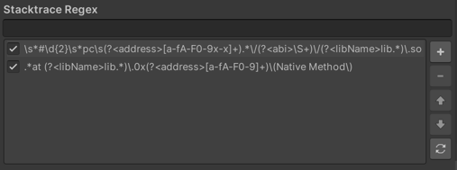

# Android Logcat Settings

Use the Android Logcat Settings window to customize the behavior of the Android Logcat window and tools.

To open the Android Logcat Settings window in the Unity Editor, go to **Edit** > **Preferences** > **Analysis** >  **Android Logcat Settings** (Windows) or **Unity** > **Settings** > **Analysis** > **Android Logcat Settings** (macOS) from the main menu in Unity. The settings are grouped under the following sections:
- [Android Logcat Settings](#android-logcat-settings)
  - [Messages](#messages)
  - [Message Colors](#message-colors)
  - [Memory Window](#memory-window)
  - [Packages](#packages)
  - [Stacktrace Regex](#stacktrace-regex)
  - [Symbol Extensions](#symbol-exensions)
  
Use the **Reset** button at the bottom of the Settings window to restore the default settings.

## Messages

Use **Messages** section to customize the appearance and the number of the messages displayed on the Android Logcat window.

|**Setting**|**Description**|
|---|---|
|**Max Cached Messages**|Specifies the maximum number of log messages Unity stores in memory that you can view later in the Logcat window. You can adjust the value as per your need such that it doesn't impact the application performance.|
|**Max Displayed Messages**|Specifies the maximum number of log messages to be displayed in the Logcat window. This value cannot be greater than the value specified in the Max Cached Messages. Increase or decrease the value to make navigating messages easier during debugging.|
|**Font**|Specifies the font for the messages displayed in the Logcat window. You can customize the font to improve readability of the messages.|
|**Font Size**|Specifies the font size for the messages displayed in the Logcat window. You can customize the font size to read the messages conveniently on different screen sizes.|

## Message Colors

Use **Message Colors** setting to customize the color of the log messages displayed in the Android Logcat window. Customizing the colors can help you differentiate between different types of log messages, making it easier for you to identify any issues. You can assign different colors to log messages based on their priorities, such as **Verbose**, **Debug**, **Info**, **Warn**, **Error**, and **Fatal**. For more information about the priority levels, refer to Android documentation on [Filtering log output](https://developer.android.com/tools/logcat#filteringOutput).

To customize the log message color, click anywhere on the swatch displayed next to the log message priority level to open the color picker. On the color picker interface, use slider or text box to set your preferred RGB or Hexadecimal color code. Alternatively, you can set the color you prefer using the **Swatches** option at the bottom of the color picker. For more information about Swatches, refer to <a href="https://docs.unity3d.com/Manual/EditingValueProperties.html#swatch-libraries">Creating swatch libraries</a>.

## Memory Window

Use the **Request Interval ms** setting to specify a time interval to request memory information for the selected application on the connected device. The minimum time interval that you can specify is 500ms.

## Packages

Use the **Max Exited Packages** setting to specify the maximum number for the applications selected in the Package Selector that are now closed. This allows you to restrict the number of entries in the Package Selector dropdown for closed applications to prevent overpopulating the dropdown.

## Stacktrace Regex

Use the **Stacktrace Regex** setting to configure regular expressions used for resolving function address and library names. You can add new regular expressions, remove, or disable the existing ones.

From the regular expressions list, the one at the top is used for resolving the function address and library name. If it fails, the next one in the order is used as a fallback. You can modify the order as per your preference.

For more information, refer to [configure stacktrace regular expressions](stacktrace-utility-set-up.md#configure-stacktrace-regular-expressions).

## Symbol Extensions

Use the **Symbol Extensions** setting to specify file extensions which are appended to symbol file names during stacktrace resolving.

For example, if the symbol file name is `libunity` and the specified symbol extensions are `.so.sym`, `.so.dbg`, the Stacktrace Utility tool looks for `libunity.so.sym` and `libunity.so.dbg` symbols.